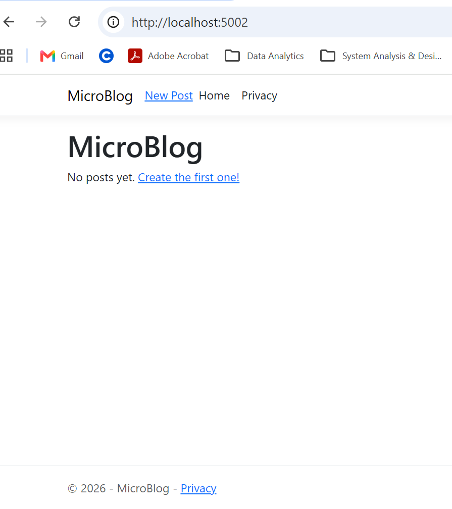
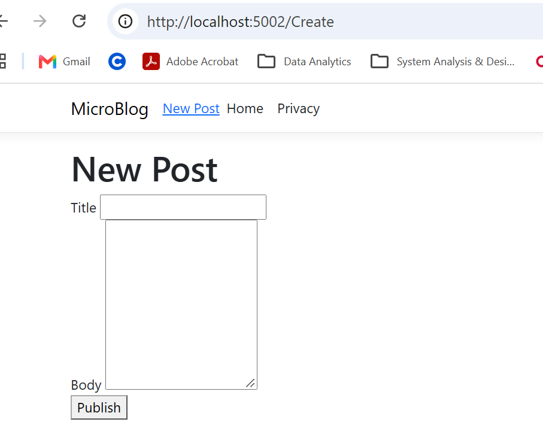
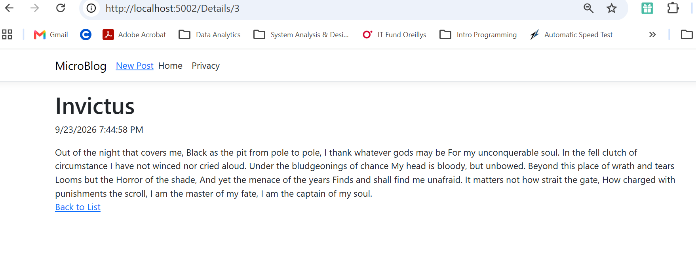

# MicroBlog

## Description

MicroBlog Razor Pages App for ASP.NET course where users can create/view/list blog posts. Posts are saved to a JSON file.

## How to Run

1. Open a terminal in the MicroBlog project folder.
2. Run: dotnet run
3. Open the localhost address displayed in the terminal.
4. If no posts, choose the option to create the first post.
5. If there are posts, then choose "New Post" at top of page.
6. Fill in required fields and click "Publish".
7. To view the full details of a post (ex. Invictus poem that is truncated), click "ReadMore".

## Screenshots

### Index Page

### Create Page

### Details Page

